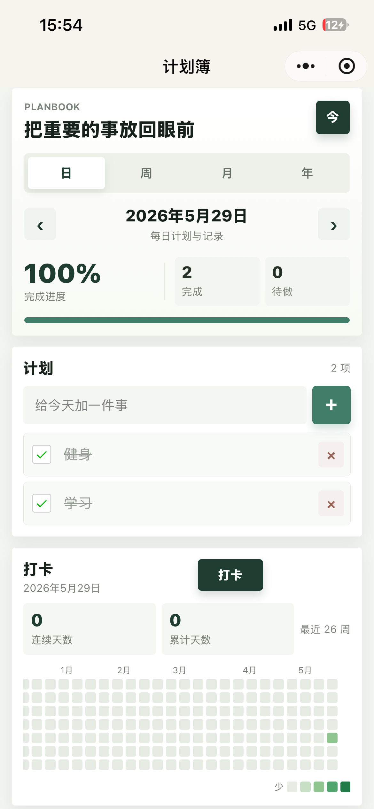

# 猫鱼计划

一个清爽的个人计划与记录微信小程序，支持按日、周、月、年制定计划，记录复盘，并通过打卡热力图观察自己的持续行动。

## 项目简介

猫鱼计划是一个面向个人时间管理和目标追踪的小程序。它不是复杂的项目管理工具，而是更轻量的“日常计划簿”：用户可以快速写下当前周期的计划，勾选完成状态，留下复盘记录，并用类似 GitHub Contributions 的热力图查看近期行动轨迹。

## 功能特性

- 日 / 周 / 月 / 年四种计划视图
- 前后切换时间周期，一键回到今天
- 添加计划、勾选完成、删除计划
- 每个周期独立保存复盘记录
- 支持每日打卡与取消打卡
- 最近 26 周打卡热力图
- 热力图按每日完成任务数分为 5 档颜色
- 自动统计累计打卡天数与连续打卡天数
- 使用微信小程序本地缓存保存数据
- 无后端依赖，导入即可运行

## 截图

> 可在上传 GitHub 前将预览截图放到 `docs/images/`，然后替换下面的图片路径。

```md


```

## 目录结构

```text
.
├── app.js
├── app.json
├── app.wxss
├── pages
│   └── index
│       ├── index.js
│       ├── index.json
│       ├── index.wxml
│       └── index.wxss
├── project.config.json
├── sitemap.json
└── README.md
```

## 运行方式

1. 安装并打开微信开发者工具。
2. 选择“导入项目”。
3. 项目目录选择本仓库根目录。
4. AppID 可填写自己的小程序 AppID，也可以使用测试号或游客模式。
5. 点击“编译”后即可预览。

## 数据存储

当前版本使用微信小程序本地缓存保存数据：

- `planbook:v1`：保存日 / 周 / 月 / 年计划与记录
- `planbook:checkins:v1`：保存每日打卡数据

本地缓存适合个人原型和单设备使用。如果需要多设备同步，可以后续接入微信云开发或自建后端。

## 设计方向

界面强调低干扰、清晰层级和快速记录：

- 顶部展示当前周期、完成进度和任务统计
- 中部处理计划输入与任务列表
- 打卡模块展示连续行动反馈
- 记录区用于自由复盘和阶段总结

## 后续规划

- 增加计划优先级、标签和分类
- 增加提醒时间与订阅消息
- 增加复盘模板，例如“完成了什么 / 卡在哪里 / 下一步”
- 增加今日首页，汇总年、月、周、日的当前重点
- 支持云同步和多设备数据
- 增加数据导出能力

## License

目前未指定开源协议。如需公开协作，建议补充 MIT License 或其他合适的开源协议。
